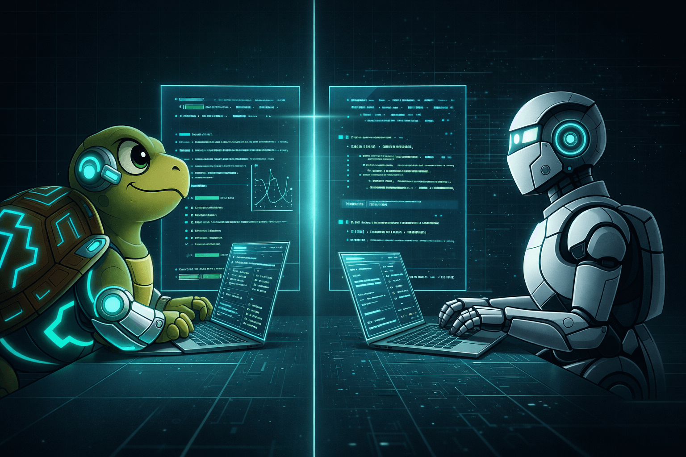

## Sitting With the Question

I've been sitting with this question recently: would I accept that a thinking model could outperform me at my own craft? Not in theory. Not as a headline. If the evidence were clear, with faster results, fewer errors, better pattern recognition, stronger iteration: would I actually accept it?

My first instinct was to reason about it. To argue edge cases, caveats, nuances. Then I realized that a concreate way to figure it out can be measuring it.

## Running the Experiment

Instead of debating AI capabilities in the abstract, it might be worth trying something concrete. Pick a task that represents your craft such as a coding problem, a design iteration, a legal analysis, a strategic memo. Then define clear criteria: accuracy, speed, depth, creativity, clarity. Finally compare, side by side. To evaluate the results, you could ask a colleague or friend in the area.

If the model performs worse, you gain confidence. If it performs better, you gain a tool. Either way, the outcome is useful. But what I found more interesting than the results was the resistance I felt *before* running the test. That resistance, it turns out, is where the real insight lives.

## When Craft Becomes Identity

For many of us, craft is not just what we do but also who we are. The idea that a machine could do it better doesn't just challenge our productivity. It challenges our sense of self.

It's possible to apply the [5 Whys](https://en.wikipedia.org/wiki/Five_whys) technique to understand what was actually going on beneath the surface.

1️⃣ Why does this feel threatening?

> Because my skill defines me.

2️⃣ Why does my skill define me?

> Because I've built status, confidence, and meaning around it.

3️⃣ Why does that matter so much?

> Because recognition and mastery give me a sense of value.

4️⃣ Why is that sense of value fragile?

> Because it was tied to being better than others at execution.

5️⃣ Why does execution define worth?

> Because historically, skill scarcity created differentiation. When few people could do what you do, that ability *was* your identity.

The root of the resistance couldn't be really about performance, but rather personal value. And the uncomfortable follow-up question is: what if identity doesn't have to be fixed to execution? What if it can evolve with how you use what you know?

## The Weight of What You've Already Built

There's another layer that makes this harder. It sounds something like: "I've spent ten years mastering this. I sacrificed weekends learning this stack. I built my entire career on this expertise.Was all of that time wasted if a model now performs parts of it better?

Running the 5 Whys again:

1️⃣ Why does this feel painful?

> Because I invested years.

2️⃣ Why does that investment matter?

> Because effort should retain value.

3️⃣ Why must effort retain value?

> Because we equate time invested with future relevance.

4️⃣ Why is that assumption dangerous?

> Because the world changes regardless of past effort.

5️⃣ What is the real fear underneath?

> That the past doesn't guarantee the future.

But here's what I keep coming back to: sunk cost doesn't disappear. It transforms. Deep expertise becomes better evaluation, better prompting, better integration, better judgment. You stop being the person who executes the fastest and start being the person who knows *what's worth executing*. And whether the output is actually good. Execution skill becomes leverage skill.

In Turtleand's case, this connects directly to the [70/30 specialist/generalist split](/posts/archetypes-human-work-ai-era). The years spent going deep don't lose value. They  become the foundation for knowing what to delegate and what to hold close.

## The Real Resistance

The resistance seems not that much technical but psychological. It's easier to argue that models lack nuance than to confront what it means if they don't. It's easier to defend tradition than to redefine identity.

The real shift isn't asking "Am I still the best executor?". It's asking "What role becomes available to me now?" That reframing doesn't diminish what you've built. It opens a different door.

## What Opens Up From Here

So I'll leave you with the original question: if the evidence were clear, would you accept that a thinking model is better than you at your craft? 

Instead of anchoring to what you were, it might be worth asking: what becomes possible if execution is cheaper? What higher-level problems could you now solve? What could you become with these tools as extensions of your understanding rather than replacements for it?
