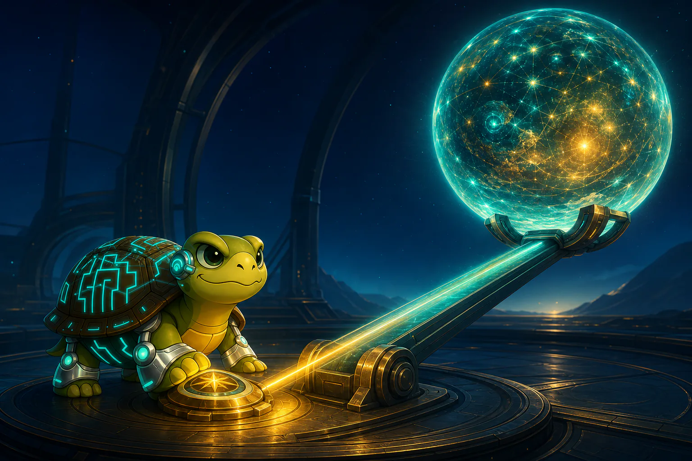

AI is a lever. It does not decide what deserves to move. It multiplies the force applied to it.

Archimedes imagined a lever powerful enough to move the world. AI gives human choices a similar kind of reach. One decision can now shape thousands of outputs, actions, and experiences.

That scale makes the human core more important, not less. Judgment grows from lived consequences. Creativity comes from seeing context differently. Intent chooses what matters. Ethics sets the limits.

AI can help examine patterns, generate possibilities, and execute at speed. But when judgment is weak, it amplifies confusion, bias, and harm. When direction is clear, it amplifies insight, imagination, and useful action.

The relationship is symbiotic: AI provides reach; humans provide direction and responsibility. The central question is not how powerful the lever becomes. It is who holds it, what they value, and where they choose to move the world.
