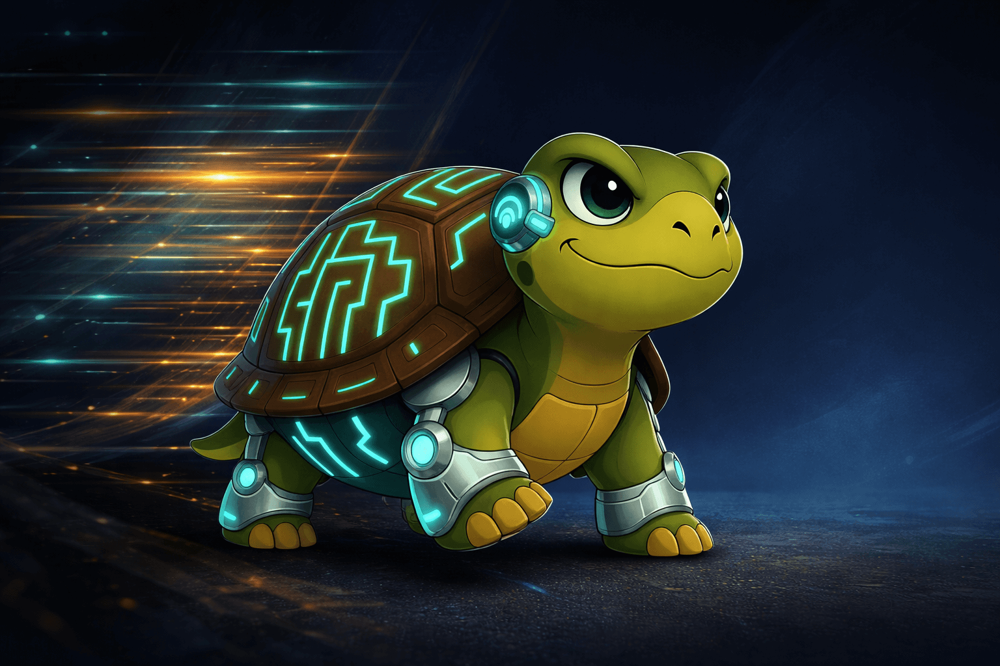

## The Old Question, Revisited

"Should I be a generalist or a specialist?" used to feel like casual career advice — the kind of thing you'd hear at a conference or read in a self-help book and then forget about over coffee. It was useful, but low-stakes. You could always course-correct later.

That question feels different now. With AI covering more ground faster than any individual ever could, the choice between breadth and depth is no longer just about career tactics. It's starting to feel like a question about *identity* — about what kind of relationship you want to have with your own work, and how much of it you're willing to hand over.

## Two Ways of Moving Through the World

Let's look at the two archetypes honestly, not as labels to pick from a menu, but as tendencies we all carry.

**The Generalist** moves across domains. They connect dots, switch contexts, and adapt fast. In an AI world, they can use tools to quickly get up to speed in unfamiliar territory — drafting, researching, prototyping — without needing years of study first.

Their strengths are real: adaptability, pattern recognition, low switching costs when entire industries shift overnight. But there's a shadow side. When AI makes it easy to *sound competent* in almost anything, the generalist's edge starts to blur. Many people can now produce passable work across many fields. The risk is becoming the hands and muscles of an AI brain — executing without truly understanding what you're building or why.

**The Specialist** goes deep. They build mental models over years that predate and outlast any particular tool. They don't just use AI to produce faster — they use it to go further into territory they already understand. In high-stakes contexts — medicine, engineering, security — this depth is what makes people trust them.

But depth has its own trap. If you narrow too far into a domain that gets automated, or if you become so focused that you lose sight of the broader landscape, you end up *locally correct and globally irrelevant*. The world shifts, and you're the last person to notice.

## What AI Actually Changed

Here's the shift that makes this question feel urgent: AI made breadth cheap and depth rare.

Before AI, being broadly capable was genuinely valuable because it was hard. Learning a new field took time. Synthesizing across domains required real effort. Now, anyone with a good prompt and a capable model can draft a strategy document, write code in an unfamiliar language, or summarize a research paper in minutes.

That's powerful, but it also means that what used to be the generalist's advantage — covering a lot of ground — is now something AI does well on its own. The people who *felt* like generalists are now finding that their edge has been quietly hollowed out.

Meanwhile, depth — genuine, hard-won understanding of *why* things work, not just *how* to make them work — has become rarer and more valuable. Not because deep knowledge was ever easy, but because the contrast is sharper now. When everyone can produce surface-level competence, the ability to go underneath the surface stands out.

## A path within reach

If breadth is cheap and depth is rare, the most resilient posture isn't choosing one over the other — it's going deep in something meaningful while staying aware of the broader landscape.

Think of it as having one strong root and several sensing branches. The root is your non-delegable understanding — the domain where you can genuinely tell when AI is wrong, where your judgment carries weight, where you've earned trust through years of engagement. The branches are your peripheral awareness — enough breadth to notice when the ground is shifting, to connect your depth to adjacent fields, to see opportunities and threats early.

## Understanding Both Slows and Protects

There's a tension here worth sitting with. Human understanding *is* a bottleneck in AI-assisted work. We slow things down. We ask for explanations. We need time to verify.

But that bottleneck is also what keeps us in control. Two futures diverge from this point:

In one, people accept outputs they don't fully understand because it's faster. The loop accelerates, but it becomes fragile — built on trust that was never verified.

In the other, people deliberately expand their understanding where it matters most. The loop is slower, but it's resilient. Every approval carries weight because someone actually *knows* why they're approving it.

Specialists expand that frontier of understanding. Generalists depend on that expansion. If nobody goes deep — if everyone just orchestrates AI without truly understanding what it produces — then nobody remains in control. The system moves faster than anyone can audit.

## There's no right or wrong formula

There is no universally correct balance between generalization and specialization. Everyone ends up choosing one either consciously or not.

In Turtleand's case:
- 70% specialist — deep, non-delegable understanding that preserves agency, trust, and the ability to question things instead of blindly following.
- 30% generalist — enough breadth to sense shifts early, connect domains, learn new things, and delegate.

Depth is slower and more demanding, but it keeps you in control. Breadth keeps relevance, flexibility, and exploration alive.
