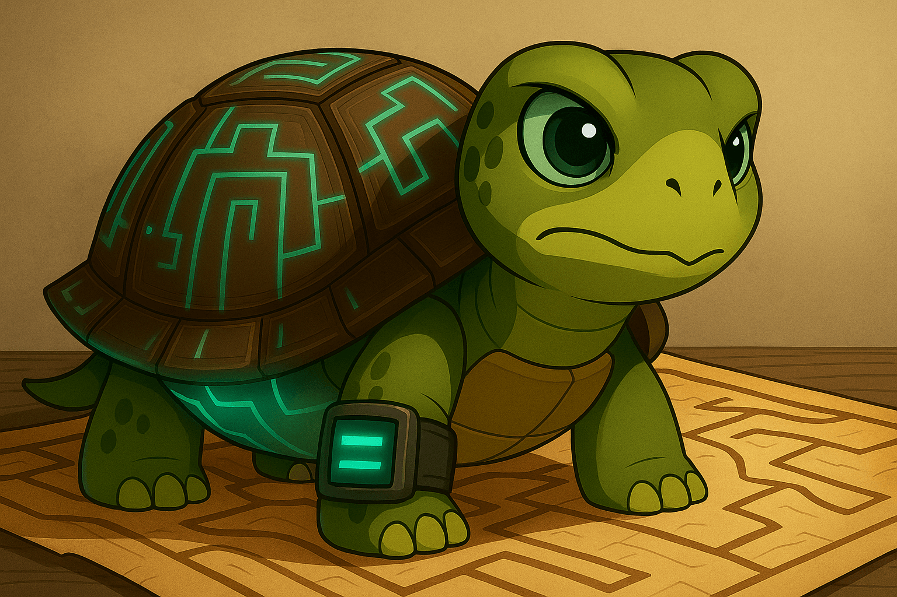

## The New Frontier Is the Question

Humans and machines together are now capable of generating more answers and solutions than ever before. But here's the real challenge: are we focusing on the *right* questions? Are we solving problems that actually matter?

## Compass for Transformation

Throughout history, the act of questioning has shaped the course of civilization. What if the Earth isn't the center of the universe? Are there broader forces at play beyond our immediate perception? These radical questions opened new dimensions of thought.

Today, questioning may be more important than ever. Questions act as a compass—pointing us in meaningful directions, even if we don't yet know the exact destination.

We humans have a critical role here. It’s not just about critiquing the latest AI models and asking, "Why aren’t you smarter?" It’s about reflecting inward while exploring outward—using our questions as our internal guidance system.

Asking the right questions is already a significant step. They spark ideas, fuel exploration, and can lead to radical transformation.

## Keep Questioning, Keep Evolving

We don't need to have all the answers. But we need to nurture the ability to ask the essential, timely, and even uncomfortable questions.

What big, bold questions have do you have? Why do they feel urgent or meaningful to you? What future could they unlock if explored?

