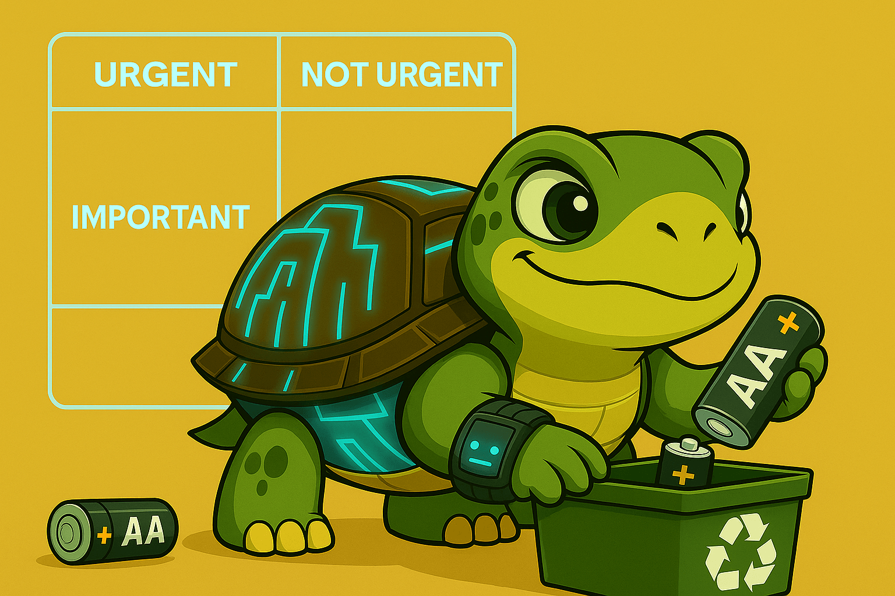

## The Framework Behind Smarter Decisions

The Eisenhower Matrix is a simple yet powerful decision-making framework. It helps you prioritize tasks based on their urgency and importance, dividing them into four categories:

|                   | **Urgent**  | **Not Urgent**         |
| ----------------- | ----------- | ---------------------- |
| **Important**     | Do it now   | Schedule it            |
| **Not Important** | Delegate it | Eliminate or ignore it |

The core idea is this: **you should only focus on the tasks in the Important rows**. Delegate or dismiss the rest. This approach frees up time, mental energy, and attention for what actually matters.

## Delegating to AI: A Practical Test

In this simple case, I needed to dispose of two used AA batteries and I didn't know where. I was short on time to do the research myself, so I triggered the following "deep search" prompt while doing other things:

> Where can I safely and ecologically dispose of used AA batteries in my city?\
> I’m looking for official collection points or active recycling campaigns during June 2025.\
> Ideally, I’d like precise locations (addresses or institutions) and confirmation that they accept common alkaline batteries (AA/AAA). I’m also interested in whether containers are available at supermarkets, local government offices, or metro stations. Avoid generic or outdated suggestions.
>
> - Waste type: Alkaline AA batteries
> - Date: June 2025
> - I need accessible, up-to-date, and officially confirmed options.

## Deep Search Result

I handed the query over to my assistant and moved on with my day.

A few minutes later, I got back a detailed report. Two promising locations stood out: a nearby pharmacy and a recycling container in a neighborhood park. Both were within walking distance.

I wasn’t completely sure if it would work, but I decided to try anyway.

## Checking the results

The next day, I went to the pharmacy and — **as guaranteed as change** — I found a small recycling bin right next to the counter. I dropped the batteries in without issues. Done in under a minute.

## Conclusion

It may not be a jaw-dropping example. Still, I wanted to share it because of how smooth, practical, and simple it was. Delegating this minor search to AI saved me time and effort, and let me focus on more important work.

