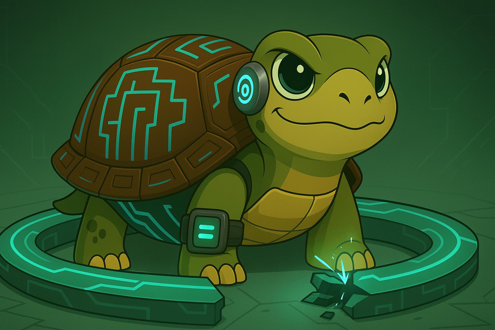

## The Cost of Passive Participation

What’s the value of a loop that outgrows us? Can it remain sustainable?

AI models are clearly advancing—their trajectory seems undeniable by now. But what about us? Are humans evolving at a pace that keeps us in the loop?

If we remove ourselves from the cycle, wouldn’t we be optimizing something other than a human tool? If humans don’t actively participate in the iterations, the tool may evolve in a direction disconnected from our values and needs. It might develop its own trajectory, identity, and purpose—no longer anchored in human context.

## Remaining at the Center of the Cycle

I’m not saying we shouldn’t continue optimizing AI models. I’m saying that we, as humans, cannot shy away from our responsibility to grow and improve—for two key reasons:

1. **We’re actually the bottleneck in the loop.**  
    The cycle pauses, waiting for human input—once it’s provided, things happen instantaneously, and the loop resumes again. It’s not that we’re waiting in line; from a human perspective, the process feels lightning speed.  
    The system won’t simply outpace human speed because it’s designed for us, and we're the bottlenecks by design.  
    Theoretically, there could be loops that exclude humans—but would those still be suitable or beneficial for us? As explained in Goldratt’s book *The Goal*, systems cannot move faster than their bottlenecks. 

2. **The tool was created by humans, intended to help and advance humanity (at least initially).**  
    What’s the point of creating such a powerful advance that we can’t understand, influence, or evolve with? A tool that grows independently from us—would it still be a tool, or something else entirely?

    Side note: Intelligence, in and of itself, is a fascinating concept. But that’s a separate conversation. Ultimate Intelligence doesn’t have to revolve around any particular species—including humans. After all, humans are just motes of dust in a vast universe, and it's highly likely that we're not that interesting from an Ultimate Intelligence perspective.

## **Growth as Our Responsibility**

*Maybe* being the bottleneck in this process puts us in a fortunate position—one where things happen for us almost instantly, without delay.  

In other words, systems already operate at speeds beyond what we can fully control or manage. This creates pressure for us to grow—perhaps faster than ever before. If we truly want more of everything, delivered more quickly, then we must also evolve to keep up. If we don't evolve, the acceleration we initiated might leave us behind. To crave acceleration is to accept the responsibility to evolve.  

As Jim Rohn once said: *"The most important question to ask is not 'What am I getting?' The most important question to ask is 'What am I becoming?"*. We still have the chance to grow with intention—and to continue shaping the cycle in ways that make humanity better.

---

## Video

<iframe width="560" height="315" src="https://www.youtube.com/embed/ziIKR7w8LNQ?si=9us5ZRqHD7mlAt7Z" title="YouTube video player" frameborder="0" allow="accelerometer; autoplay; clipboard-write; encrypted-media; gyroscope; picture-in-picture; web-share" referrerpolicy="strict-origin-when-cross-origin" allowfullscreen></iframe>
