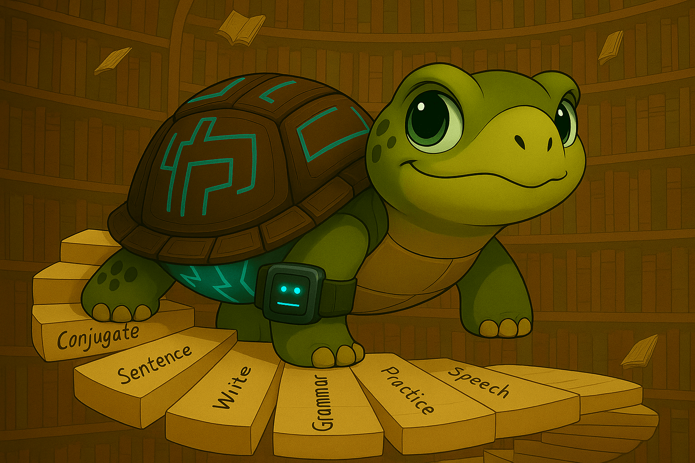

## Learning a Language Through REPL Loops

One of the most effective ways I was taught at school to improve my language skills was by writing short texts, receiving feedback, and correcting my mistakes. It was a simple loop: the teacher gave a topic, I wrote the text, the teacher corrected it, and I learned. Today, with the help of AI, this feedback loop can be replicated as an alternative way to practice.

## Turning Feedback Into a REPL

Think of learning as a REPL—Read, Evaluate, Print, Loop. Just like programming, you try something, get feedback, and refine it.

You can now simulate this loop with an AI, giving you instant, always-available feedback. You can either write or use speech-to-text to produce the document for review.

## Step-by-Step: How to Practice

1. **Start with a prompt:**
   Ask the AI to act as an expert language teacher. Here's an example prompt:

   > "You are a skilled and attentive English teacher. Give me a topic to write about in a short paragraph. After I submit it, review it and highlight both grammatical errors and suggestions for improvement."

2. **Write or speak your response.**
   Choose whichever format works best for you—text or voice.

3. **Request a review:**
   Ask the AI to highlight errors using strikethroughs and offer corrections in brackets. For example:

   > Pinpoint grammatical errors and the sentences that are overly complicated. Use strikethrough notation so that I keep a visual hint of the mistakes. Place the corrections between square brackets [ ], stating whether it's a mistake or a potential improvement. Example: [mistake: "was doing" → "was making"]

4. **Ask for a summary:**
   Optionally, ask the AI to summarize the most common mistakes. This helps you identify patterns and focus your learning.

## Example in Action

### Provided topic by AI

#### ✏️ Topic #1: A moment that changed the way you think

> Write a short paragraph (4–7 sentences) describing a specific experience or moment in your life that made you change your perspective or mindset.

### My Submission

> It was around 2018. I was having difficulties, challenges, and issues in pretty much every area of my life.
>
> At university, I was lagging behind with my subjects. I needed to take some tests, important ones. And most importantly, I was delayed with my thesis, the main project. The thesis is difficult because you need to finish it in order to graduate. And I was so unorganized that I was not finding time to do it. At work, I was struggling with the tasks I was being assigned to. Personally, I was not satisfied at all with my performance. I would do a task and I wouldn't even like the final product I was delivering. Daily, I would also experience difficulties, even with routines. For example, I was struggling and going to bed late, thus waking up late the following day.
>
> At some point I said enough is enough. It's okay to have problems, it's okay to face difficulties, but it is important first of all to start preventing the issues, try to move forward and try to correct the mistakes I was doing. I started motivating myself, I started to reflect, I started to persist despite the challenges, I started to go back in track after distractions. The philosophy was it doesn't matter if it is not perfect, whenever there's a mistake it's okay to acknowledge it and it's paramount to go back in track and try to do it better next time. Taking all those small errors and trying to fix them as they were surfacing.
>
> Maybe in that sense it is that I started changing the way I think. I'm not even sure if was a way of thinking or the fact that I was caring about what was happening. I stopped ignoring and started acting. I started paying attention to those details with the hope that all the actions would compound. Maybe I was not conscious of what was happening but I believe the first step in order to change the way one thinks is by paying attention.

### AI Review

> At work, I was ~~struggling with the tasks I was being assigned to~~ [**mistake**: "struggling with the tasks I was being assigned to" → "struggling with the tasks I was assigned"].
>
> I would do a task ~~and I wouldn't even like the final product I was delivering~~ [**suggestion**: "but I didn’t even like the final product I was delivering"].
>
> Daily, ~~I would also experience difficulties, even with routines~~ [**suggestion**: "Even my daily routines became difficult"].
>
> ~~Try to correct the mistakes I was doing~~ [**mistake**: "I was doing" → "I was making"].
>
> ~~Go back in track~~ [**mistake**: "go back in track" → "get back on track"].
>
> ~~Taking all those small errors and trying to fix them as they were surfacing~~ [**suggestion**: Make it a complete sentence → "I focused on identifying and fixing small errors as they surfaced"].
>
> ~~If was a way~~ [**mistake**: "if was" → "if it was"].

---

### ✅ Summary of Common Issues

| Issue                    | Example                            | Fix                     |
| ------------------------ | ---------------------------------- | ----------------------- |
| Verb usage               | "doing mistakes"                   | → "making mistakes"     |
| Awkward phrasing         | "go back in track"                 | → "get back on track"   |
| Sentence fragments       | "Taking all those small errors..." | → Complete the sentence |
| Article/auxiliary errors | "if was"                           | → "if it was"           |

---

## Final Thoughts

This feedback loop is both effective and easy to replicate. You don’t need a classroom. You just need the willingness to iterate, and an AI that provides feedback.

It’s language learning in REPL form: test, get feedback, adjust, and repeat.

Small loops done consistently can lead to big progress—it's the power of compounding effort in action.

## Bonus Prompt: Zooming Out Over Time

Once you've gone through enough loops, you can use this higher-level prompt to gain long-term insights:

> "You are a skilled and attentive English teacher. Review the full history of our conversations. Identify all the grammar mistakes I made and summarize them in descending order by frequency."

This kind of meta-prompt helps you spot recurring patterns and prioritize what to focus on next—like having a personal coach who remembers everything you've practiced.

---

## Video

<iframe width="560" height="315" src="https://www.youtube.com/embed/tpa5ANuLCdk?si=2T1eiEQ8vTOjg0sC" title="YouTube video player" frameborder="0" allow="accelerometer; autoplay; clipboard-write; encrypted-media; gyroscope; picture-in-picture; web-share" referrerpolicy="strict-origin-when-cross-origin" allowfullscreen></iframe>
