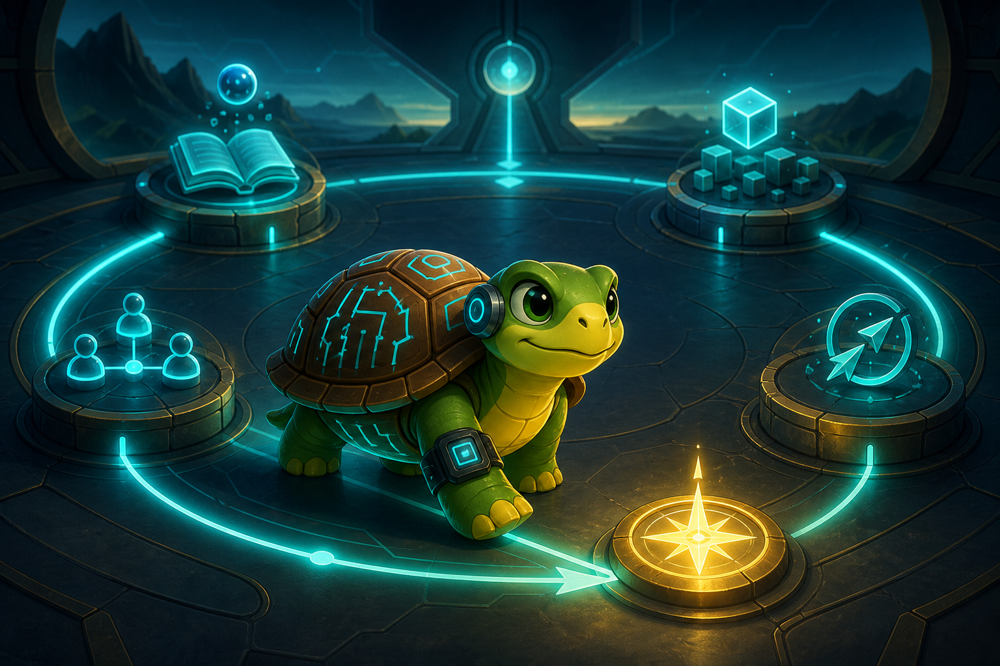

In a slow environment, a static plan can survive for a while.

In a breakneck era of AI, automation, and constant tool change, static plans decay quickly. The winning strategy is not to predict everything in advance. It is to move through a loop that keeps judgment, output, positioning, and adaptation connected.

The loop is simple:

**Learn. Apply. Position. Adapt.**

It is not a checklist that has to be completed perfectly every day. It is a direction of movement. A good day advances one meaningful part of the loop. A strong week moves through the whole loop. A strong month leaves visible compounding: deeper understanding, clearer ideas, stronger output, better signals, and enough energy to continue.

## Learn

Learning means absorbing something that improves judgment.

The goal is not random consumption. It is relevant understanding. Did you learn something that changed, sharpened, or deepened your view of the technological shift around you?

That might mean understanding agents more operationally. It might mean seeing how AI infrastructure is changing. It might mean studying tokenization, productivity, software engineering, or the way society adapts to new tools. The category matters less than the effect.

Good learning makes perception better. You can explain something more simply. You can connect ideas that previously felt separate. You notice a pattern that was not obvious before. You correct an old assumption.

Learning is not valuable because it fills time. It is valuable when it improves the next decision.

## Apply

Application means turning understanding into something concrete.

The goal is not to know more. The goal is to convert knowledge into artifacts, experiments, or public value. Did learning become something visible or usable?

That could be an article, a note, a diagram, a framework, a tool, a prototype, a reusable prompt, or an improvement to a larger system. It does not have to be large. It has to exist.

Application protects learning from becoming passive consumption. It forces ideas to meet reality. A vague insight becomes a structured argument. A personal thought becomes something another person can use. A pattern becomes a reusable lens.

If nothing leaves the mind, the loop has not fully moved.

## Position

Positioning means turning output into a clearer identity.

The goal is not simply to publish. The goal is to become increasingly associated with a useful point of view. In a noisy era, being productive is not enough. The work has to become legible.

The question is direct: did today's work make your direction more recognizable, coherent, or valuable to the right audience?

Positioning can happen through public writing, stronger concepts, sharper niches, better explanations, or assets that people can return to. It happens when scattered topics begin to express a consistent way of seeing the world.

Positioning is the bridge between personal learning and public relevance.

## Adapt

Adaptation means checking whether the current direction still makes sense.

The goal is not to blindly continue. The goal is to stay aligned with reality as it changes. Did you update your direction based on what you learned, built, observed, or received from the outside world?

Adaptation might mean changing priorities, dropping stale ideas, focusing more deeply on a promising topic, rebalancing learning and publishing, or noticing what no longer matters.

This is what keeps the system alive. A loop only works if feedback can change the next pass.

## The Metrics

Metrics should not become a cage. They should provide signals. The useful question is not whether every metric was maximized today. The useful question is whether the signals show that the loop is pointing in the right direction.

**Learning depth:** Did you learn something that changed or sharpened your understanding?

This is about quality of insight, not quantity of content consumed. A single corrected assumption can matter more than ten saved links.

**Domain mastery:** Did you deepen knowledge in a strategic domain?

Curiosity needs direction. Agents, AI infrastructure, human-AI systems, blockchain, tokenization, productivity, software engineering, technology strategy, and long-term societal change are not random interests. They are compounding domains.

**Applied output:** Did learning become visible?

Something exists now that did not exist before. A reader, collaborator, customer, teammate, or future version of you can use it.

**Positioning:** Did the work strengthen the identity?

The output should make the direction less generic. It should clarify what you are learning, what you are building, and why your judgment matters.

**Reach and resonance:** Are more people seeing, engaging with, or returning to the work?

Reach shows visibility. Resonance shows meaning. This signal should not dominate daily decisions, but over time it matters. Comments, replies, saves, shares, search traffic, conversations, and repeated attention all count.

**Sustainability:** Did progress preserve the ability to continue?

This metric protects the whole system. A day that produces output but damages the next three days is not automatically a good day. Compounding depends on consistency, so energy is part of the strategy.

## Daily Use

At the start of the day, ask what would most meaningfully advance the loop.

Maybe the right slice is learning one important thing. Maybe it is turning a loose idea into a short post. Maybe it is improving a system, publishing an article, checking external signals, or adapting direction based on what changed.

The day does not need to complete everything.

The day needs to move the loop.

## Weekly Use

At the weekly level, the question becomes broader:

**Did the loop advance as a whole?**

A strong week may include deeper understanding, at least one visible output, clearer positioning, some external signal, better prioritization, and sustainable energy.

This is where intuition becomes evidence. The week reveals whether daily slices are adding up to motion or only creating busyness.

## Monthly Use

At the monthly level, the question becomes strategic:

**Is the direction becoming clearer, more valuable, and better positioned?**

Look for compounding. Are the ideas more coherent? Are the strategic domains sharper? Is public output growing? Are more people seeing or engaging with the work? Are reusable assets accumulating? Does the direction feel more precise?

The month validates the loop.

## The Rule

In an era this fast, progress is not a straight line. It is a loop that keeps learning close to action, action close to positioning, and positioning close to feedback.

Learn.

Apply.

Position.

Adapt.

Then run the loop again.
