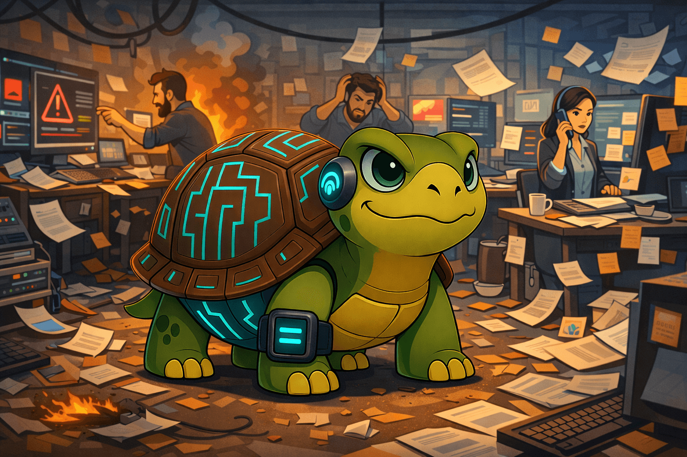

## Seniority in a Chaotic Environment

Seniority is about how you behave when things are unclear, overloaded, or breaking down.

Here are ten concrete signals of seniority, each expressed as a simple, observable trait:

* **Shape the working model** — Introduce or refine processes that reduce future chaos instead of reacting to today's mess.
* **Coach, don't substitute** — Help others adopt better patterns without doing their work for them.
* **Prioritize ruthlessly** — Decide what truly moves the needle and consciously let non-critical work wait.
* **Communicate upwards** — Make invisible effort and risks visible to management in a calm, solution-oriented way.
* **Set boundaries** — Limit your involvement intentionally so responsibility does not silently collapse onto you.
* **Anticipate problems** — Surface risks early and propose mitigations before issues escalate.
* **Delegate with ownership** — Distribute both tasks and accountability, not just execution.
* **Think in systems** — Look beyond tasks to how people, code, and delivery flows interact.
* **Optimize for outcomes** — Focus on team-level results rather than personal productivity alone.
* **Model calm under pressure** — Your emotional response in chaos sets the tone for everyone else.
