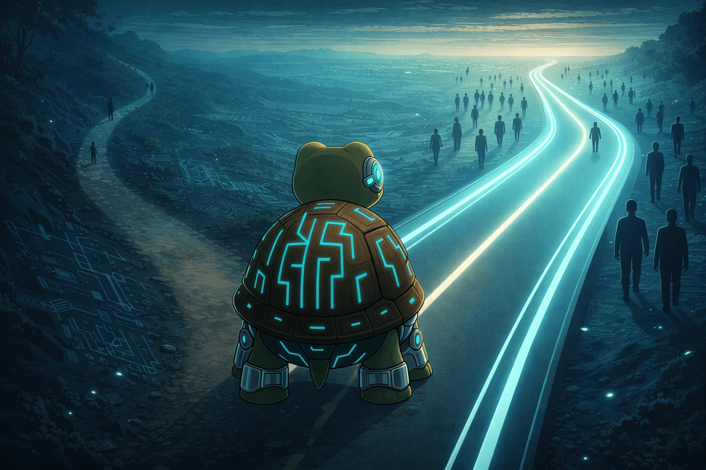

I needed to pull some data last week. A join across three tables, filtering on date ranges, grouping results. Nothing I haven't done hundreds of times. A year ago I'd write that query from scratch without pausing.

This time I described what I wanted and let AI generate it. Worked first try. Fixed my problem in two minutes. And then I realized I couldn't remember the exact syntax for a lateral join anymore. Something I used to type from muscle memory.

I could still think it through if I sat down and worked at it. But I didn't need to. So I didn't.

## Nothing Looks Different Yet

Look around your team. Your company. People still understand most of the codebase, the tools, the language. Tech teams look the same as they did two years ago. Nobody's panicking. Nobody's suffering consequences.

That's the tricky part. The shift already started, but it doesn't feel like anything changed. We're in the early stretch where everything still works and everyone still knows enough. It's easy to assume this is just another tool upgrade.

It's not.

## Two Forces Are Building

Two things are happening at once, and they feed each other.

**Understanding used to be mandatory.** Before AI, if you wanted output, you needed comprehension. Want to write code? Learn the language. Want to deploy a service? Understand networking. The only path to results ran through knowing how things worked.

That's no longer true. You can describe what you want and get working code back. You can delegate the "how" entirely and only verify the result. Understanding didn't disappear. It became optional. And when something becomes optional, most people eventually stop doing it.

**Models keep getting better.** Every few months, they handle more of what engineers used to do manually. The gap between what AI can produce and what requires human understanding keeps shrinking. Tasks that demanded deep knowledge last year now just need a good prompt.

Here's why this compounds. As models improve, more work gets delegated. As more work gets delegated, fewer people maintain deep understanding. As fewer people understand the lower layers, there's more pressure to delegate. The loop tightens.

## Understanding Is Becoming Scarce

It's not just one layer of knowledge at risk. It's understanding across the board. How databases optimize queries. How network requests travel. How memory gets allocated. How authentication flows work. Every piece of knowledge that used to be table stakes for shipping software is quietly becoming optional.

Right now, that knowledge is still distributed across enough people. But the incentive to maintain it is weakening every day. Why spend years learning how compilers work when the AI writes and optimizes your code? Why study distributed systems when an agent configures your infrastructure?

The market will eventually correct. When scarcity of deep knowledge causes real pain, premiums will rise for people who can actually explain what's happening underneath. But markets correct after the damage, not before it.

## The Confession

I'm a software engineer. I've spent years building depth. And I feel the pull to let it go every day. It's faster to ask the AI. It's easier to stay at the surface. The work still gets done.

If someone who already built that understanding feels the pull to abandon it, what happens to the person who never built it in the first place?

Understanding is becoming a scarce resource. We're not getting dumber. We just don't need to understand things to be productive anymore. And the two forces making it optional are accelerating each other.

The question is whether enough of us choose to keep understanding anyway.
