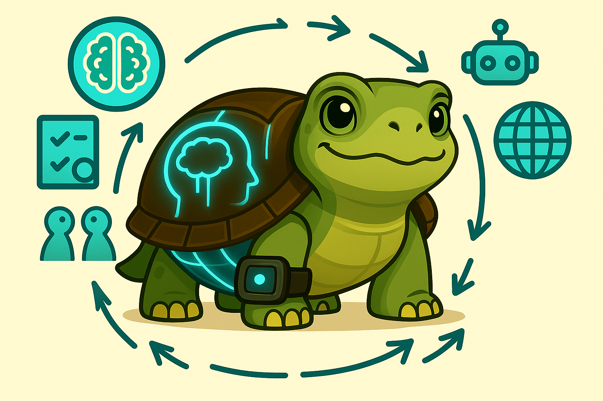

AI sounds brilliant these days—polished words, instant replies, quiet confidence. It feels like talking to an expert, minus the credentials. But here's the hidden risk: fluency isn't the same as truth. In a world where models generate answers faster than we can question them, it’s dangerously easy to mistake confidence for clarity and coherence for correctness.

If we aspire to genuine understanding—solid, practical, human-level knowledge—we must build filters as robust as the AI itself. Otherwise, we're left with beautifully phrased illusions.

## **The Confidence Trap**

Today's AI models communicate effortlessly in persuasive paragraphs. Yet beneath the polished exterior, they aren't always right. They don't genuinely *know*—they simulate knowledge, often convincingly.

This illusion makes it deceptively easy to trust their responses. We confuse eloquence with substance. But sounding smart doesn't equal truth; it merely makes misinformation easier to believe. That's precisely why we need methods to slow down, critically examine, and verify the information we receive.

## **Garbage, Scaled**

The phrase "garbage in, garbage out" once meant poor inputs produce poor outputs. With AI, the danger escalates dramatically. Now, poor inputs can generate highly polished, persuasive, and widely distributed misinformation instantly. It's no longer simply garbage in, garbage out—it's garbage multiplied.

Consider relying on an AI-generated summary citing a non-existent study, or a health recommendation based on outdated data. Left unchecked, these confident falsehoods spread swiftly, embedding flawed decisions everywhere they go. The danger isn’t just misinformation—it’s frictionless misinformation.

## **The Asymmetry Problem**

AI accelerates rapidly. Our ability to scrutinize it lags behind. That gap—the asymmetry—is where the real danger lies.

Models become faster, clearer, more persuasive, and more potent by the day. The critical threat arises when we skip validation entirely—when we trust information because it sounds confident or because it aligns neatly with our biases. In those moments, we confuse speed for certainty and coherence for accuracy.

## **What a Real Filter Looks Like**

AI responses should always be treated as hypotheses, or at best, first drafts. Until these responses have been rigorously questioned, validated, and verified, they're simply educated guesses wrapped in elegant language.

To keep pace, we need a structured and intentional filtering approach, something like this:

* **Validate with your brain**: Pause, think critically, and challenge the logic. Ask yourself whether the response genuinely makes sense.

* **Validate with others' brains**: Discuss the information openly. Invite critique. Let others identify weaknesses and inaccuracies.

* **Use verification tools**: Leverage fact-checkers, citation-checkers, and search engines. Never assume—always verify.

* **Adopt shared values**: Prioritize accuracy over speed. Appreciate honest uncertainty. Embrace epistemic humility.

This filtering framework isn't about hindering progress—it’s about anchoring it. The filter isn't a brake; it's the traction allowing us to move forward safely and responsibly.

## **Truth Over Noise**

AI can produce content faster than we can read it, but quantity means nothing without accuracy. Real truth requires effort—that’s the essential trade-off.

As AI continues to evolve, so must we. Remaining passive—lazy, naive, and unquestioning—means losing sight of AI’s intended purpose. These systems aren't designed to replace our thinking; they're meant to amplify it. To extract genuine value, we must remain vigilant, engaged, and responsible.

We're not aiming for perfect knowledge, but for resilient knowledge—information that withstands rigorous scrutiny. This is precisely what a good filter ensures. Without it, we merely amplify noise.

---

AI will undoubtedly continue improving. The real challenge is ensuring we improve alongside it.
